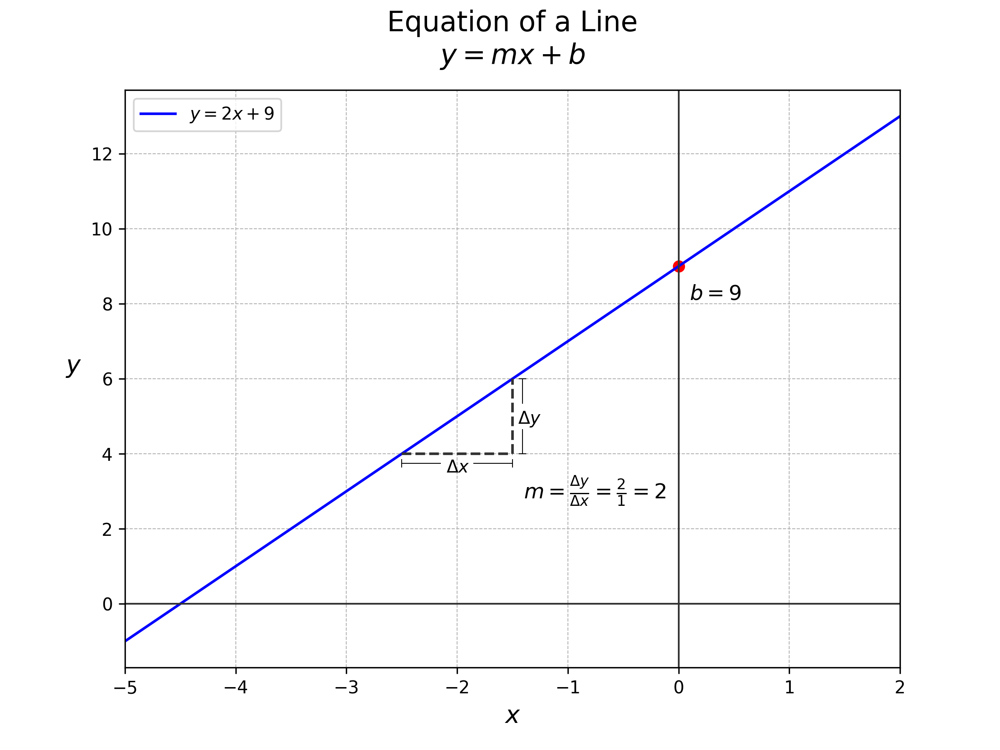

# Theoretical Foundations

## Basic Concepts

### Dependent and Independent Variables

In linear regression, the goal is to predict the value of a dependent variable (also known as the response or target variable) based on one or more independent variables (also known as predictors or features). The dependent variable is what you are trying to predict, while the independent variables are the inputs that influence the prediction.

### Linear Relationship

A linear relationship implies that the change in the dependent variable is proportional to the change in the independent variable(s). In other words, if you plot the data points on a graph, they should form a pattern that can be approximated by a straight line.

## Mathematical Formulation

### Equation of a Line

The equation of a straight line in a two-dimensional space is given by:

$$y = mx + b$$

where:
- $y$ is the dependent variable,
- $x$ is the independent variable,
- $m$ is the slope of the line, and
- $b$ is the bias (y-intercept).

  

### Slope and Bias

- **Slope ($m$)**: The slope of the line indicates the rate of change of the dependent variable with respect to the independent variable. A positive slope means that as the independent variable increases, the dependent variable also increases. Conversely, a negative slope means that as the independent variable increases, the dependent variable decreases.
- **Bias ($b$)**: The bias is the value of the dependent variable when the independent variable is zero. It represents the point where the line crosses the y-axis.

### Hypothesis Function

In the context of linear regression, the hypothesis function represents the model's prediction. For a simple linear regression with one indeWpendent variable, the hypothesis function is:

$$\hat{y} = \theta_0 + \theta_1 x$$

where:
- $\hat{y}$ is the predicted value of the dependent variable,
- $\theta_0$ is the bias (analogous to $b$),
- $\theta_1$ is the slope (analogous to $m$),
- $x$ is the independent variable.

For multiple linear regression, where there are multiple independent variables, the hypothesis function generalizes to:

$$\hat{y} = \theta_0 + \theta_1 x_1 + \theta_2 x_2 + \ldots + \theta_n x_n$$

where:
- $x_1, x_2, \ldots, x_n$ are the independent variables,
- $\theta_1, \theta_2, \ldots, \theta_n$ are the coefficients (slopes) corresponding to each independent variable.